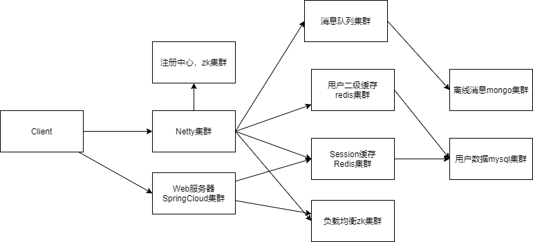

# BambiIM

- Protobuf由protobuf.exe自动生成，请在common中的proto包中进行本地地址更改，避免生成message时出错
- 记得修改每个模块的zookeeper 以及redis地址

内部设计等详情文档请移步--- > 

项目架构

# FIXED LOG

### 2023/03/02 

- ​		解决SLF4J依赖的版本冲突问题                                  
- ​		解决创建zk父节点时的json转换问题 