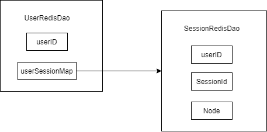
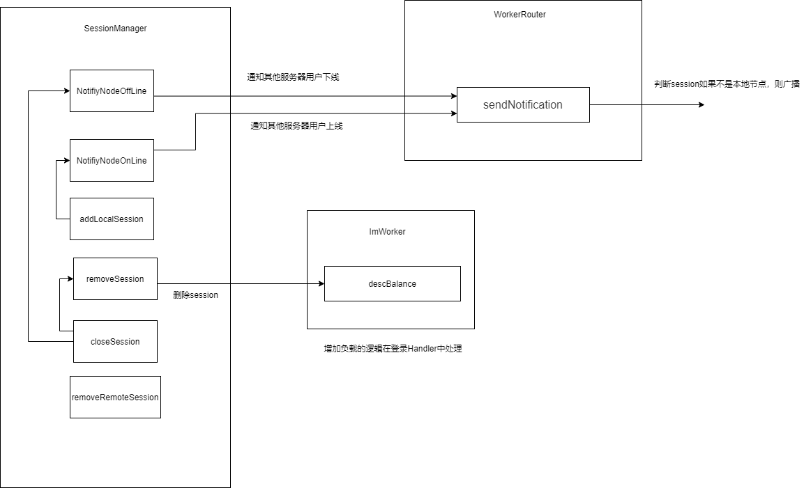

# 实现分布式Session会话存储

​			对于Channel与Session的关系，我已经有一篇文章[Session与Channel容器属性](http://8.142.7.247:8954/archives/netty-yuan-ma-xue-xi-session-yi-ji-channel-de-rong-qi-shu-xing);Session在客户端与服务器端的作用都可以理解为保证用户User与通道Channel之间的关系，可以认为是一个胶水类。

​			但是对于分布式netty服务器端来说，除了简单的正向绑定与反向绑定之外，还需要考虑许多问题

- ​	系统支持用户多平台登录，一个用户可能同时拥有多个session
- ​    海量Session的存储

- ​    多服务器之间的session共享


### 海量Session的存储与user & Session间的关系

​		对于Session的存储，本系统采用的是Redis集群，在登录成功时将session持久化到redis存储中；

​		但就跟之前所说的，**一个用户会含有多个session**，而这些session可能会存储在不同的服务器中，这样的映射关系如何设计呢？在这里，我采用了定义一个User持久化类内部维护一个map映射，用来保存用户与session的关系，而session则保存着用户与channel之间的关系

> ​	在redis的存储类型选择上，目前使用了基础类型String , 后期可能会改用其他类型？(TODO)
>
> ​	对于String类型存储用户会话信息，网上有很多的篇文章来介绍，也有很多为了方便查询将key的名称中间以"."来进行分割。本系统中则是以":" 来进行分割



​			具体的存储逻辑服务则放在对应的service类中，这里只展示接口，具体实现请参考github仓库源码

1. Session存储逻辑

```java
public interface ISessionRedis {

    /**
     * 保存session到redis缓存中
     * @param sessionRedisDao
     */
    void saveSession(SessionRedisDao sessionRedisDao);

    /**
     * 根据sessionid获取对应session
     * @param sessionId
     * @return
     */
    SessionRedisDao getSessionById(String sessionId);

    /**
     * 移除session
     * @param sessionId
     */
    void removeSessionById(String sessionId);
}
```

2.    User存储逻辑

```java
public interface IUserRedis {

    /**
     * 向redis中存储user
     *
     * @param userRedisDao
     */
    void saveUser(UserRedisDao userRedisDao);

    /**
     * 从redis中根据userid获取对应user
     *
     * @param userId
     * @return
     */
    UserRedisDao getUserByUserId(String userId);

    /**
     * 向user中添加session
     *
     * @param userId
     * @param sessionRedisDao
     */
    void addSession(String userId, SessionRedisDao sessionRedisDao);

    /**
     * 从user中移除session
     *
     * @param userId
     * @param sessionId
     */
    void removeSession(String userId, String sessionId);
}
```


### SessionManager 一个逻辑的封装

​		因为session的CRUD操作还携带着许多复杂的逻辑，以及跨服的广播以及消息的转发，所以将对Session的操作提取封装在SessionManager中，并使用单例模式，在启动类中注入bean。

​		具体代码过长，为了提升阅读体验，则将代码尽可能的省略，将基础的方法调用逻辑以画图的方式展现在下方。`WorkerRouter`和`ImWorker`类，内容请参考前置文章		[Netty集群的消息接收与转发](https://github.com/RichardReindeer/BambiNettyIM/blob/main/docs/ServerInternalSend.md)和[Netty集群的动态命名与注册](https://github.com/RichardReindeer/BambiNettyIM/blob/main/docs/NameAndAddress.md)



​		服务器如何判断我接收到的信息是用户想要发送的信息，还是其他服务器转发过来的信息呢？

- 用户会在登录逻辑中将session进行存储调用对应的`addLocalSession`方法。

- 只需要在接收到信息的handler中判断当前收到的session用户是否登录即可
- 如果没有办法从当前的通道中拿到session，则证明当前用户没有登录，该消息为转发过来的消息

### ServerSession,本地与远端

​		前文也提到，这是一个分布式服务，除了本地的session之外还需要和远端进行session的互通，相比于单体模式的serverSession，分布式中则需要将共同需要的逻辑抽象为接口，分别实现本地session和远程session的逻辑处理

```java
public interface IServerSession {

    void writeAndFlush(Object protobufMsg);

    String getSessionID();

    /**
     * 验证用户登录是否合法
     * @return
     */
    boolean isValid();

    /**
     * 获取用户id
     * @return
     */
    String getUserID();
}
```

#### 		LocalSession

​		本地session相对复杂一些，就像先前提到的，session负责实现user与channel之间的互通，必然也需要实现对应的绑定逻辑

```java
    public static final AttributeKey<LocalSession> SESSION_KEY = AttributeKey.valueOf("SESSION_KEY");
    // 本地session管理核心属性， 用来实现user - channel的相互导航
    private Channel channel; // 通道
    private UserDTO userDTO; // 用户实体类
    private final String sessionID; // 唯一id
/**
 * 实现双向绑定
 *
 * @return
 */
public LocalSession bindChannel() {
    channel.attr(LocalSession.SESSION_KEY).set(this);
    channel.attr(SystemConfig.CHANNEL_NAME).set(JsonUtil.pojoToJson(userDTO));
    isLogin = true;
    return this;
}

/**
 * 通过channel的attributeKey 获取对应存储的localsession
 *
 * @param context
 * @return
 */
public LocalSession getSession(ChannelHandlerContext context) {
    LocalSession localSession = context.channel().attr(LocalSession.SESSION_KEY).get();
    return localSession;
}
```

​		且在设计写入逻辑时，也考虑到了channel水位过高的问题，在netty源码中channel对应函数`isWriteable`返回结果表示当前channel是否支持写入。如果当前channel无法写入时，可以将消息暂时存储在mq或者其他sql中。

```java
/**
 * 将msg写入通道<br>
 *  TODO 进行水位检测，当水位过高时暂停写入，将数据暂存在mq或者其他sql中 , 避免出现数据积压
 * @param protobufMsg
 */
@Override
public synchronized void writeAndFlush(Object protobufMsg) {
    if(channel.isWritable()){
        channel.writeAndFlush(protobufMsg);
    }else {
        // 暂存逻辑
        logger.debug("当前通道忙无法写入");
    }
}
```

#### 		RemotoSession

​		相比与localSession，远程session则需要结合转发器一起使用，根据session获取对应远程通道的转发器，并将消息放入转发器中进行发送。

```java
@Override
public void writeAndFlush(Object protobufMsg) {
    BambiNode node = sessionRedisDao.getNode();
    long id = node.getId();
    PeerSender peerSender = WorkerRouter.getInstance().getPeerSender(id);
    if(peerSender!=null){
        peerSender.writeAndFlush(protobufMsg);
    }
}
```